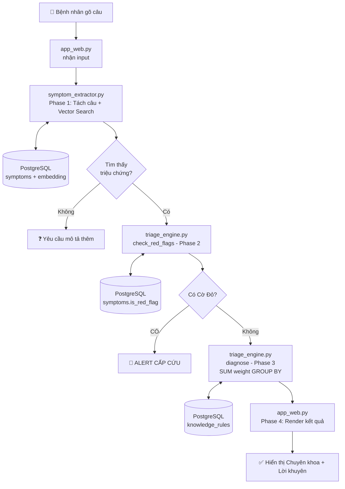

# 🏥 Hiểu Toàn Bộ Hệ Thống AI Triage Medical — Từ A đến Z

> [!NOTE]
> Tài liệu này giải thích **mọi thứ** diễn ra trong dự án theo thứ tự thật sự xảy ra, từ lúc bật Docker cho đến khi bệnh nhân nhìn thấy kết quả trên màn hình.

---

## 🗺️ Bức Tranh Tổng Thể — 3 Tầng của Hệ Thống

Toàn bộ dự án gồm 3 tầng độc lập:

```
┌─────────────────────────────────────────────────────┐
│  TẦNG 1: Giao diện (Frontend)                       │
│  → File: app_web.py (Streamlit)                     │
│  → Bệnh nhân gõ chữ, nhìn thấy kết quả ở đây       │
├─────────────────────────────────────────────────────┤
│  TẦNG 2: Logic AI (Backend)                         │
│  → File: symptom_extractor.py  (Phase 1)            │
│  → File: triage_engine.py      (Phase 2 & 3)        │
│  → Đây là "bộ não" xử lý toàn bộ                   │
├─────────────────────────────────────────────────────┤
│  TẦNG 3: Kho Dữ Liệu (Database)                    │
│  → PostgreSQL + pgvector (chạy trong Docker)        │
│  → Nơi lưu tri thức y khoa và kết quả phiên        │
└─────────────────────────────────────────────────────┘
```

---

## 📅 TRƯỚC KHI CHATBOT CHẠY — Giai Đoạn Khởi Tạo (1 Lần Duy Nhất)

### 🐘 Việc 1: Khởi động Docker

```bash
docker-compose up -d
```

Docker như một "hộp máy tính ảo" bên trong máy bạn. Bên trong có PostgreSQL 16 + pgvector extension. Sau khi chạy, bạn có một DB trống với đầy đủ bảng từ `schema.sql`.

---

### 📊 Việc 2: Nạp Dữ Liệu Y Khoa

```bash
python3 final_data_loader.py
```

Đọc 5 file CSV trong `data/` và nhét vào database:

| File CSV | Chứa gì | Đưa vào bảng nào |
|---|---|---|
| `symptom_mapping.csv` | 131 tên triệu chứng (Anh+Việt) | `symptoms` |
| `Symptom-severity.csv` | Điểm nguy hiểm (1-7) | `symptoms.is_red_flag` |
| `disease_mapping.csv` | 41 bệnh + thuộc khoa nào | `diseases`, `specialties` |
| `symptom_precaution_vn.csv` | Lời khuyên chăm sóc | `diseases.description` |
| `dataset.csv` | 4900+ ca bệnh mẫu | `knowledge_rules` |

> [!IMPORTANT]
> Bảng `knowledge_rules` là "Cuốn sách giáo khoa Y khoa" của AI. Từ 4900 ca bệnh mẫu, code tính trọng số: "Bệnh Thoái hóa khớp thường đi kèm Đau khớp háng (weight: 0.72)..." và lưu vào DB.

---

### 🧠 Việc 3: Tạo Vector Embeddings (Quan trọng nhất)

```bash
python3 scripts/ingest_embeddings.py
```

Hãy tưởng tượng mỗi triệu chứng như "Đau khớp háng" là một **điểm trong không gian**. Những từ có nghĩa giống nhau nằm gần nhau:

```
"đau khớp háng" ●
                  ● "đau háng"       ← Gần nhau = cùng nghĩa
                ● "nhức xương chậu"

"sốt cao" ●
            ● "nhiệt độ cao"         ← Gần nhau = cùng nghĩa
```

Model `BAAI/bge-m3` chuyển **văn bản → 1024 con số** (vector tọa độ). File này lần lượt lấy từng tên triệu chứng, cho model "nhai", rồi lưu 1024 số đó vào cột `embedding` trong bảng `symptoms`.

---

## 🚀 KHI BỆNH NHÂN GÕ — Luồng Xử Lý Thời Gian Thực

**Ví dụ:** Bệnh nhân gõ _"Tôi bị đau háng và cẳng chân"_

---

### 🟢 PHASE 1 — Trích Xuất Triệu Chứng bằng Vector
**File:** `symptom_extractor.py` → hàm `extract()`

**Bước 1.1: Tách câu (Clause Splitting)**
```
"Tôi bị đau háng và cẳng chân"
 → tách theo "và", dấu phẩy...
 → ["Tôi bị đau háng", "cẳng chân"]
```

**Bước 1.2: Vector hóa từng vế**
```
"Tôi bị đau háng" → bge-m3 → [0.12, -0.34, 0.87, ...] (1024 số)
"cẳng chân"       → bge-m3 → [0.45,  0.23, -0.67, ...] (1024 số)
```

**Bước 1.3: Tìm kiếm trong Database**
```sql
SELECT id, name, 1 - (embedding <=> [0.12,-0.34,...]::vector) AS similarity
FROM Symptoms
ORDER BY similarity DESC LIMIT 3;
```
Toán tử `<=>` là **Cosine Similarity** — đo góc giữa 2 vector. Góc nhỏ → nghĩa giống nhau → similarity cao (gần 1.0).

**Bước 1.4: Lọc nhiễu (Threshold = 55%)**
```
"Đau khớp háng" → 0.82 ✅ (> 0.55, giữ lại)
"Đau cẳng chân" → 0.76 ✅ (> 0.55, giữ lại)
"Chóng mặt"     → 0.31 ❌ (< 0.55, loại bỏ)
```

**Output:** `[{id:45, "Đau khớp háng"}, {id:89, "Đau cẳng chân"}]`

---

### 🔴 PHASE 2 — Bộ Lọc Sinh Tồn (Red Flag)
**File:** `triage_engine.py` → hàm `check_red_flags()`

```sql
SELECT id, name FROM Symptoms
WHERE is_red_flag = true AND id IN (45, 89);
```

`is_red_flag = true` khi điểm severity trong CSV >= 5 (thang 1-7). Ví dụ: "Đau thắt ngực", "Khó thở nặng", "Mất ý thức"...

```
Không có cờ đỏ → Cho qua Phase 3 ✅
Có cờ đỏ      → DỪNG, hiện cảnh báo đỏ lên UI 🚨
```

---

### 🔵 PHASE 3 — Chẩn Đoán Rule-Based (Toán Học)
**File:** `triage_engine.py` → hàm `diagnose()` → `rule_based_score()`

```sql
SELECT d.name, s.name AS specialty, SUM(kr.weight) AS score
FROM Diseases d
JOIN Specialties s ON d.specialty_id = s.id
JOIN Knowledge_Rules kr ON d.id = kr.disease_id
WHERE kr.symptom_id IN (45, 89)
GROUP BY d.id, d.name, s.name
ORDER BY score DESC;
```

**Kết quả minh họa:**
```
"Thoái hóa khớp"      → 0.9 + 0.4 = 1.30 ← TOP 1 ✅
"Viêm khớp dạng thấp" → 0.6 + 0.3 = 0.90
"Sốt xuất huyết"      → 0.0 + 0.2 = 0.20
```

---

### 🟡 PHASE 4 — Đóng Gói và Hiển Thị
**File:** `app_web.py`

```sql
SELECT description FROM Diseases WHERE id = [ID_thoái_hóa_khớp];
-- → "Lời khuyên: Nghỉ ngơi | Chườm nóng | Tập vật lý trị liệu"
```

Streamlit render lên giao diện:
```
✅ Phase 1 (Vector): Đau khớp háng (82%), Đau cẳng chân (76%)
ℹ️ Phase 2 (Sinh tồn): Không có dấu hiệu đe dọa tính mạng.
📋 Kết quả: KHOA CƠ XƯƠNG KHỚP — Thoái Hóa Khớp (Điểm: 1.30)
💡 Lời khuyên: Nghỉ ngơi | Chườm nóng | Tập vật lý trị liệu
```

---

## 🗃️ Vai Trò Từng Bảng Trong Database

| Bảng | Vai trò |
|---|---|
| `specialties` | Danh mục chuyên khoa (Tim mạch, Nội, Cơ xương khớp...) |
| `symptoms` | 131 triệu chứng + vector embedding 1024D |
| `symptom_synonyms` | Từ đồng nghĩa: nhức đầu = đau đầu = đầu nặng |
| `diseases` | 41 bệnh lý + lời khuyên + vector embedding |
| `knowledge_rules` | **Bộ não chẩn đoán**: Bệnh X ↔ Triệu chứng Y + trọng số |
| `knowledge_chunks` | Lưu đoạn văn tài liệu y khoa (dự phòng mở rộng) |
| `patients` | Thông tin bệnh nhân |
| `chat_sessions` | Mỗi lần bệnh nhân chat = 1 phiên |
| `message_logs` | Toàn bộ tin nhắn qua lại |
| `session_symptoms` | Triệu chứng detect được trong phiên |
| `session_disease_scores` | Điểm từng bệnh (để giải thích AI) |
| `session_recommendations` | Lời khuyên đã đưa ra trong phiên |

---

## 🔗 Sơ Đồ Luồng Tổng Thể



---

## ❓ Câu Hỏi Thường Gặp

**Q: Tại sao phải tách câu trước khi vector hóa?**
> Vector của câu dài bị "nhạt" — nó mang ý nghĩa trung bình của tất cả từ. Tách ra từng vế nhỏ thì vector "đậm đặc" hơn, match chính xác hơn.

**Q: Tại sao không dùng ChatGPT/Groq cho đơn giản?**
> Dữ liệu y tế cực kỳ nhạy cảm — gửi ra ngoài vi phạm quyền riêng tư. Ngoài ra API có chi phí, giới hạn, và phụ thuộc mạng. `bge-m3` chạy offline 100%, miễn phí, và bảo mật tuyệt đối.

**Q: Số 0.55 (threshold) từ đâu ra?**
> Là con số thực nghiệm có thể điều chỉnh. Quá cao (0.8) → không match khi viết hơi khác. Quá thấp (0.2) → match lung tung (nhiễu). 0.55 là điểm cân bằng tốt cho tiếng Việt y tế.

**Q: `knowledge_rules.weight` được tính thế nào?**
> Từ 4900 ca bệnh trong `dataset.csv`. Ví dụ: 200 ca "Thoái hóa khớp", có 140 ca có "Đau khớp háng" → tần suất = 140/200 = 0.7. Nhân với điểm severity = weight cuối cùng. Bệnh có tổng weight cao nhất với triệu chứng đầu vào sẽ được chọn.
